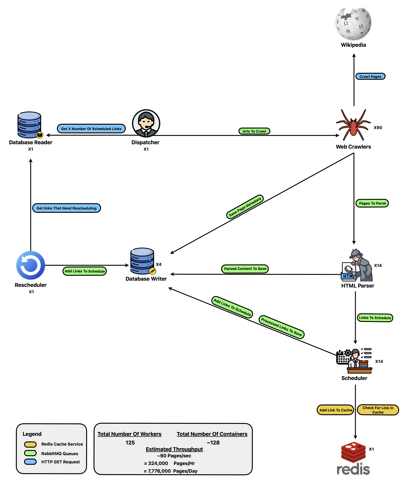
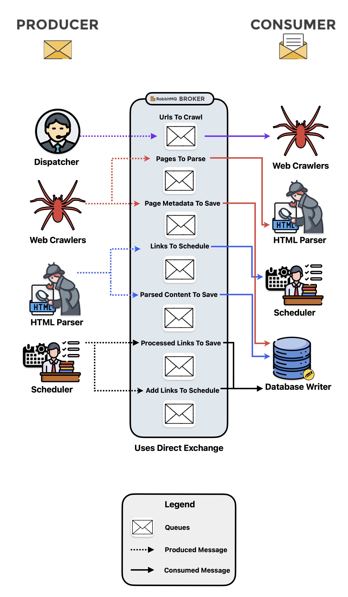

# Distributed Web Crawler & Parser System

A high-throughput, scalable, geographically distributed crawler and metadata extractor system  
inspired by early search engine architectures (e.g., GoogleBot 1.0).

Built using:
- Python microservices
- RabbitMQ
- Redis
- Prometheus + Grafana
- Docker Containers  
- Kubernetes support coming soon

---

## System Architecture

The diagram below illustrates the system’s core services, message flows, Redis caches, and  
the maximum parallelism and throughput achieved during performance testing.

**Test Environment:** Single Proxmox VM (24 vCPUs, 32GiB RAM)  
**Peak Throughput:** ~90 pages/sec ≈ 7.8 million pages/day

---

## RabbitMQ Message Flow Diagram

---

## Core Components

| Component         | Description                                                                 |
|------------------|-----------------------------------------------------------------------------|
| `Dispatcher`      | Pulls scheduled URLs from the database and publishes them to the crawl queue |
| `Web Crawlers`    | Distributed agents that fetch HTML from Wikipedia and compress/store raw HTML |
| `HTML Parser`     | Extracts metadata and outbound links from downloaded pages                 |
| `Scheduler`       | Deduplicates, filters, and schedules valid URLs for future crawling         |
| `Database Writer` | Writes parsed metadata and crawl results into PostgreSQL                   |
| `Database Reader` | Reads scheduled URLs from PostgreSQL to feed the dispatcher                 |
| `Rescheduler`     | Re-enqueues expired or failed links based on policies and freshness logic   |
| `Redis`           | Caches seen/enqueued links for deduplication and lookup                    |
| `RabbitMQ`        | Queues for all inter-service communication (crawl, parse, write, schedule)  |
| `Monitoring`      | Prometheus + Grafana dashboards for metrics and tracing (alerting WIP)      |

---

## Tech Stack

- **Languages:** Python 3.11+
- **Message Queues:** RabbitMQ
- **Cache Layer:** Redis (Seen Set, Enqueued Set)
- **Storage:** PostgreSQL
- **Deployment:** Docker Compose (Dev & Prod)
- **Monitoring:** Prometheus + Grafana
- **Geo-IP Routing (Planned):** Webshare rotating proxies or Mullvad VPN for distributed crawling

## WIP: Next Sections To Add

- Add a Quickstart section with docker-compose commands and Kubernetes commands once it's implemented

- Include a Monitoring section showing how to access Grafana

- Mention how configs are managed (shared/config_loader.py, .env, YAML structure)

- Add per-component README.md files that link back to this root doc
